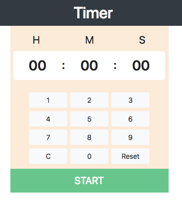
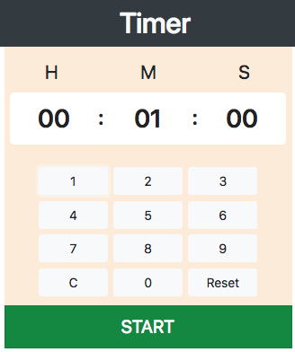
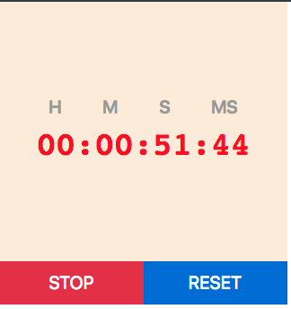
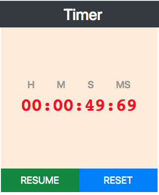

<h1>React-Timer</h1>

<h3>Fork the repository and do the following simple steps</h3>

<b>npm install</b>

<b>npm start</b>

Enter input time with the help of kepad key.if you want to reset particular block press 'C' key and if you want to reset all just simply prss 'Reset' key only

<h3>Normal UI</h3>

<h3>After input filled</h3>

<h3>After start button press</h3>

<h3>On stop press </h3>

<h3>On resume press </h3>

<h3>On reset press or completion of time</h3>

